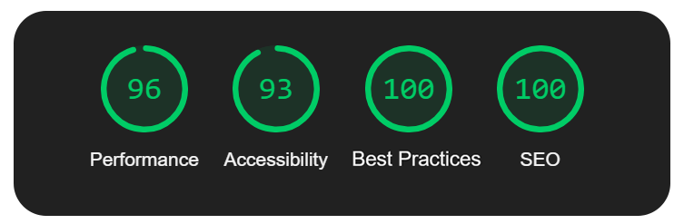

<h1> Teste Técnico para Dev Frontend Jr. </h1>

 

<a href="https://jet-frontend-test.vercel.app/" alt="Deploy">Ver Deploy</a>
·
<a href="https://github.com/guipaex/jet-test/issues" alt="Faça uma sugestão">Sugestões e Feedbacks</a>

O objetivo do teste era criar uma aplicação web responsiva utilizando NextJs, TypeScript, Tailwind, Composition Pattern, Componetização, GitFlow e finalizando com o deploy na Vercel.

# Avaliação do Lighthouse

 Um dos Critérios de Avaliação do teste foram os resultados Relatório de Desempenho do Lighthouse(Google)

    

        
        
 Resultado da versão Mobile 

    

    

        
        
 Resultado da versão Desktop 

    

Projeto criado com [Next.js](https://nextjs.org/), [TypeScript](https://www.typescriptlang.org/) [Tailwind](https://tailwindcss.com/) e [React-Icons](https://react-icons.github.io/react-icons/)

